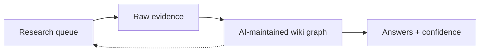
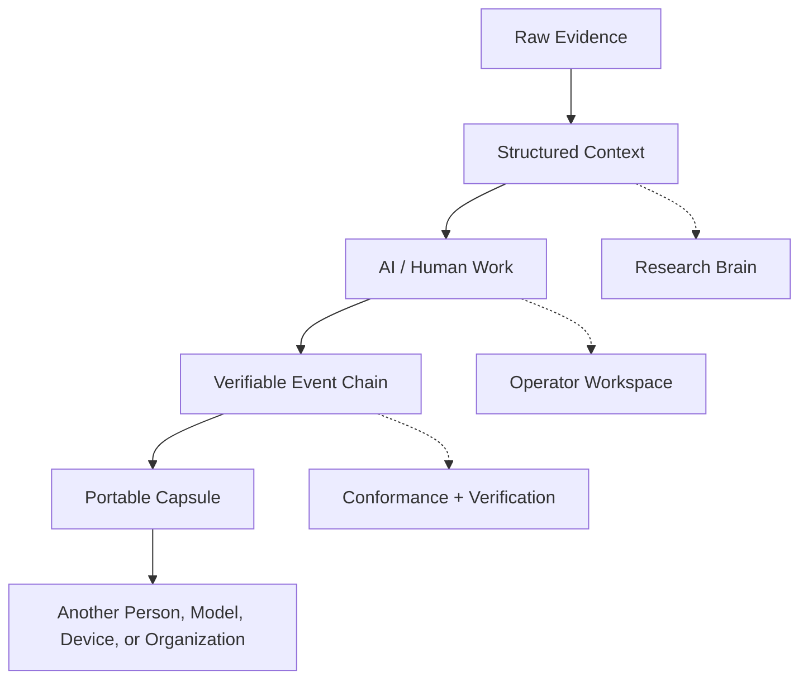

<!--
Profile README for the virionai GitHub profile.
Place this at README.md in the special virionai/virionai repository.
-->
<table>
  <tr>
    <td width="80">
      
    </td>
    <td>
      <h1>Virion.ai</h1>
      <strong><em>Infect Intelligence</em></strong>
    </td>
    <td align="right">
      
        <a href="https://virion.ai">virion.ai</a> 
        <a href="mailto:contact@virion.ai">contact@virion.ai</a> 
        <a href="https://github.com/virion">github</a>
      
    </td>
  </tr>
</table>

---

  

<h1 align="center">Virion.ai</h1>

<strong>I N F E C T &nbsp; I N T E L L I G E N C E</strong>

---

  <a href="https://virion.ai">Virion.ai</a>
  ·
  <a href="https://capsules.run">Capsules.run</a>
  ·
  <a href="https://capsules.run/load/">Open a Capsule</a>
  ·
  <a href="https://capsules.run/conformance/">Conformance</a>
  ·
  <a href="https://virion.ai/initiate">Collaborate</a>

---

## The bet

AI makes intelligence abundant.

The bottleneck is no longer only generation. The bottleneck is movement.

How does useful intelligence move between people, models, devices, organizations, workflows, and time without collapsing into screenshots, chat logs, PDFs, or proprietary app state?

Virion is building the substrate for that movement.

A durable AI work product should be something another actor can open cold, inspect, verify, continue, and hand off again. It should carry the work, the evidence, the participants, the decisions, the context, and the record of how it got there.

Not just a file.

Not just a document.

Not just an agent framework.

A transport layer for intelligence.

---

## What we build

Virion works on open infrastructure for portable, traceable, multi-actor AI work.

| Area | What it means |
| --- | --- |
| **Capsules** | Portable AI work artifacts that carry content, context, participants, payloads, and a verifiable event chain. |
| **Operators** | Local-first workspaces where humans and models turn evidence into sealed, transferable work. |
| **Research Brains** | AI-maintained research graphs where raw evidence compounds into structured knowledge. |
| **Evidence Systems** | Provenance-first patterns for regulated, high-consequence, multi-party work. |
| **Model Harnesses** | Runtime surfaces for local models, agent loops, evaluation, and handoff. |

---

## Open source projects

### [`capsules-protocol`](https://github.com/virionai/capsules-protocol)

**The open protocol for portable, signed, AI-readable records of multi-actor work. Infrastructure for intelligence that moves.**

Capsules define a portable unit of intelligence: a deterministic `.capsule` archive that carries a readable work surface, payload files, participants, embedded skills, and an append-only event chain.

The goal is simple: work should survive the tool that created it.

- Protocol specification
- JavaScript, Python, Swift, Kotlin, and Rust verification paths
- CLI and browser-readable capsule inspection
- Conformance harness
- Tamper detection
- Offline-first verification

Live surfaces:

- [Open or verify a capsule](https://capsules.run/load/)
- [View conformance](https://capsules.run/conformance/)
- [Read the roadmap](https://capsules.run/roadmap/)

---

### [`operators`](https://github.com/virionai/operators)

**A local-first investigative workspace for turning evidence into portable work.**

Operators is the command surface: an offline-capable workspace where a human operator and a local model can inspect evidence, capture context, create decision gates, maintain continuity, and export a capsule-shaped handoff.

It is built around the idea that serious AI work needs an operational surface, not just a chat box.

- Local browser workspace
- Ollama / Gemma runtime path
- Deterministic fallback mode
- Workspace modules for notes, diagrams, timelines, tables, graphs, evidence, and artifacts
- Visible event continuity
- Local export path toward Capsule handoff

Live surface:

- [Open the Operator](https://capsules.run/operator/)

---

### [`researcher-brain`](https://github.com/virionai/researcher-brain)

**A second brain for research in the era when AI does not just retrieve knowledge. It produces it.**

Researcher-Brain is a reusable scaffold for building AI-maintained research wikis from raw evidence, notes, long-form AI investigations, images, and primary sources.

It follows a loop:

The point is not to make another note-taking app.

The point is to structure a corpus so an AI system can read, organize, cross-link, question, and improve it over time.

- Immutable raw evidence
- Slug-addressed sources
- AI-maintained Logseq graph
- Research routines
- Cross-domain probes
- Confidence files
- Durable citations

---

## The system shape

The throughline across the repos:

> Intelligence should not be trapped inside the runtime that produced it.

---

## Principles

| Principle | Position |
| --- | --- |
| **Portable by default** | Work should move across tools, models, teams, and time. |
| **Verification before trust** | Recipients should be able to inspect what changed, who changed it, and what evidence was carried. |
| **Local-first where possible** | Intelligence should run close to the operator, especially in disconnected or sensitive environments. |
| **Human-readable, machine-readable** | AI work products should be legible to people and structured enough for models. |
| **Context is infrastructure** | The future bottleneck is not only compute. It is the transfer of usable state. |
| **Open protocols beat trapped platforms** | The file should remain useful even when the app disappears. |

---

## Why this exists

Modern AI systems are becoming better at producing useful work, but the work often dies in the interface.

A good answer gets trapped in a chat.

A good investigation becomes a PDF.

A useful workflow becomes app-specific state.

A model learns something useful, but the next model starts cold.

Virion is working on the missing layer between cognition and coordination: artifacts that carry enough context to continue.

That means:

- A researcher can hand a corpus to another model without losing provenance.
- A local operator can seal an investigation for another team.
- A regulator can inspect the chain months later.
- A model can resume work without needing the original chat.
- A platform can exchange intelligence without forcing everyone into the same app.

---

## Current focus

- Capsule v0.6 protocol hardening
- Cross-language conformance
- Browser-based capsule verification
- Local-first operator workflows
- Research graph scaffolds
- Evidence and provenance interfaces
- Human / AI continuation surfaces
- Better public examples and reference capsules

---

## For collaborators

This is early, real, and moving quickly.

The work needs protocol people, systems thinkers, AI engineers, security reviewers, product designers, documentation obsessives, local-model hackers, researchers, and people who understand that the next major interface is not another chat window.

It is transferable intelligence.

Start here:

- [Read the protocol](https://github.com/virionai/capsules-protocol)
- [Open a capsule](https://capsules.run/load/)
- [Try the Operator](https://capsules.run/operator/)
- [Explore Researcher-Brain](https://github.com/virionai/researcher-brain)
- [Contact Virion](https://virion.ai/initiate)

---

  <strong>AI makes intelligence abundant.</strong> 
  <strong>Virion works on how it moves.</strong>

  <a href="https://virion.ai">Virion.ai</a>
  ·
  <a href="https://capsules.run">Capsules.run</a>
  ·
  <a href="https://github.com/virionai/capsules-protocol">Capsules Protocol</a>
  ·
  <a href="https://github.com/virionai/operators">Operators</a>
  ·
  <a href="https://github.com/virionai/researcher-brain">Researcher-Brain</a>

