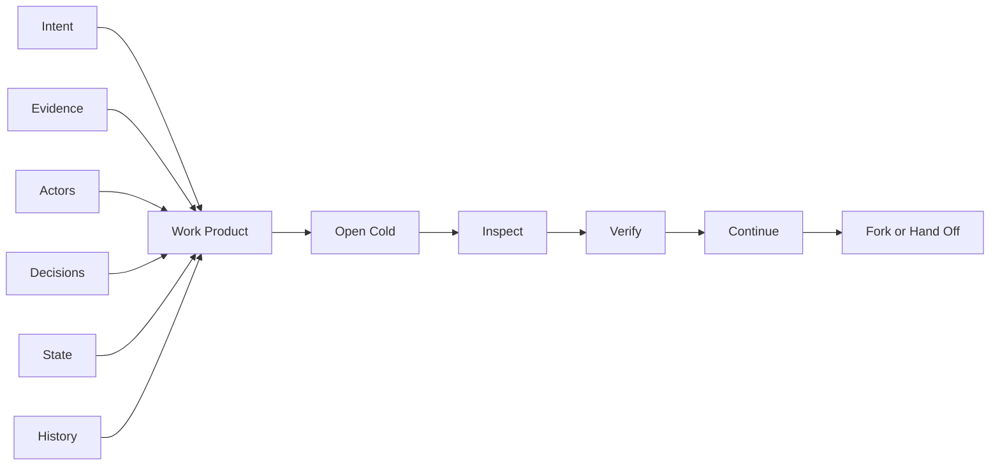

# Virion

  <strong>AI is learning to think. Virion is building the way intelligence moves.</strong>

  <a href="https://virion.ai">Website</a> ·
  <a href="https://capsules.run">Capsules.Run</a> ·
  <a href="https://github.com/virionai">GitHub</a>

---

## Intelligence Should Move

AI has made generation abundant.

The harder problem now is continuity.

Every serious AI workflow produces more than an answer. It produces intent, evidence, assumptions, decisions, participants, tool calls, state, constraints, and a record of how the work changed over time.

Most of that intelligence does not survive handoff.

It gets flattened into:

- screenshots,
- chat transcripts,
- PDFs,
- loose JSON,
- exported documents,
- proprietary application state.

The work may be visible, but it is no longer alive.

It cannot be opened cold, inspected, verified, resumed, delegated, forked, or handed off without losing the context that made it useful.

**Virion exists to solve that movement problem.**

---

## The Bet

> **Generation is becoming cheap.  
> Continuity is becoming strategic.**

The next durable layer of AI infrastructure will not be defined only by larger models or better prompts.

It will be defined by whether useful intelligence can move between:

| Boundary | What breaks today |
|---|---|
| **People** | Context gets trapped in conversations and meetings |
| **Models** | Reasoning state disappears between systems |
| **Devices** | Local intelligence lacks portable continuity |
| **Organizations** | Handoffs collapse into documents and email threads |
| **Workflows** | Tools see outputs, not the work behind them |
| **Time** | Future actors inherit artifacts without lineage |

Virion is building toward a world where AI work can travel with its context intact.

---

## What We Mean By A Transport Layer For Intelligence

A durable AI work product should be something another actor can open cold and continue safely.

Not just read.

Not just summarize.

Not just import.

**Continue.**

It should carry enough structure for a human, model, organization, or runtime to understand what happened, why it happened, who or what participated, what evidence was used, what remains unresolved, and what can happen next.

---

## Current Work

| Project | What it explores |
|---|---|
| **Capsules** | Portable units of intelligence for human-AI work, handoff, provenance, and continuation |
| **Capsules.Run** | A local workspace for opening, inspecting, and operating on capsule-based work |
| **Operators** | Structured patterns for AI-assisted execution, delegation, and review |
| **Researcher Brain** | Research workflows for synthesis, memory, and multi-step reasoning |
| **Evidence Substrate** | Durable knowledge structures for evidence, lineage, and verification |

---

## Design Principles

| Principle | Meaning |
|---|---|
| **Portable by default** | Work should not be trapped inside one app, chat, model, or vendor |
| **Inspectable cold** | A new actor should understand the artifact without private memory |
| **Evidence-bound** | Claims should remain connected to sources, decisions, and lineage |
| **Human and machine readable** | The same artifact should orient people and AI systems |
| **Model-agnostic** | Intelligence should survive movement across model providers and runtimes |
| **Continuable** | The artifact should preserve enough state for future work, not just past review |
| **Security-aware** | Provenance, permissions, and trust boundaries should be first-class concerns |

---

## The Direction

Virion is not trying to build another chat app.

We are exploring infrastructure for AI-native work products that can move across systems without collapsing into static residue.

The future will have more agents, more local models, more autonomous workflows, more specialized tools, and more fragmented execution environments.

That future needs a movement layer.

A way to package useful intelligence so it can be inspected, trusted, resumed, and transferred.

That is the work.

---

## Links

- **Virion:** https://virion.ai
- **Capsules.Run:** https://capsules.run
- **GitHub:** https://github.com/virionai
